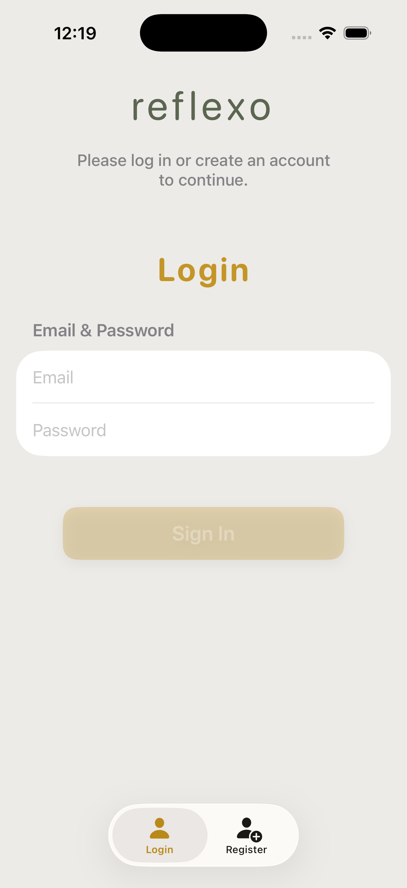
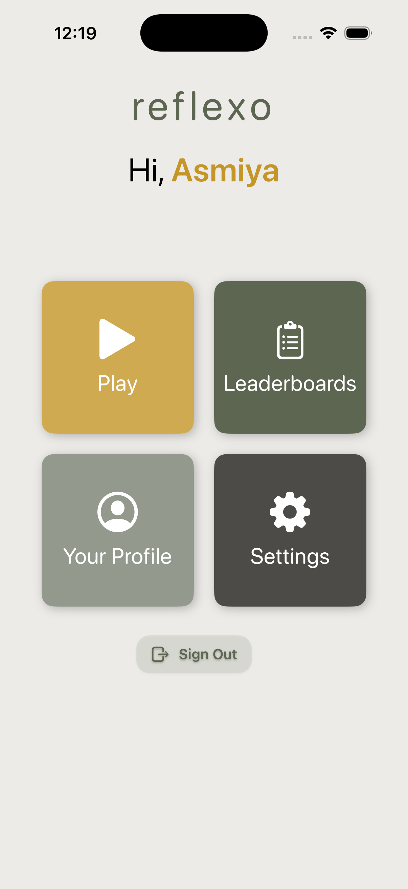
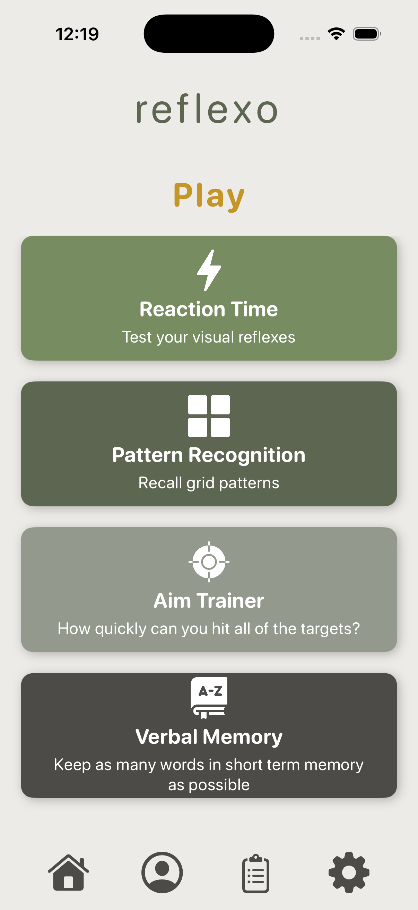
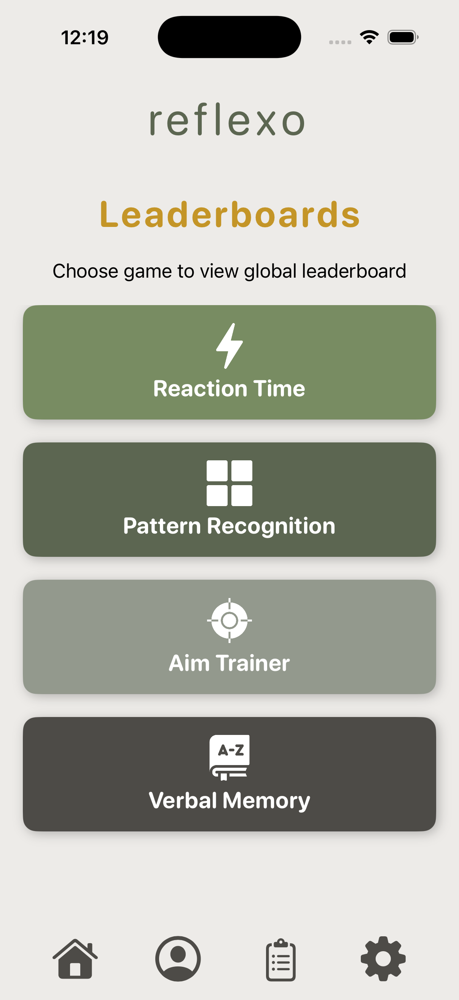

# Reflexo

Reflexo is an iOS app for training and testing your cognitive reflexes through a set of quick, replayable mini-games. Play across four game modes, track your best scores locally and in the cloud, compete on global leaderboards, and keep your high scores on your Home Screen with a widget.

Designed and developed by **Rahal De Silva** and **Asmiya Hasan**.

## Screenshots

| Login | Home | Play |
| --- | --- | --- |
|  |  |  |

### Games

| Reaction Time | Aim Trainer | Verbal Memory | Pattern Recognition |
| --- | --- | --- | --- |
|  |  |  |  |

### Leaderboard



## Features

- **Four reflex games** — Reaction Time, Aim Trainer, Verbal Memory, and Pattern Recognition.
- **Accounts & profiles** — email/password sign-up and sign-in with unique display names, backed by Firebase Authentication.
- **Global leaderboards** — per-game rankings stored in Firestore, with transactional upserts so only your best score is kept.
- **Offline history** — every attempt is saved locally with SwiftData, so stats and personal bests work without a connection.
- **Home Screen widget** — a WidgetKit extension shows your best score for each game, synced via an app group.
- **Local notifications** — reminders to keep your reflexes sharp.

## Games

| Game | Goal |
| --- | --- |
| **Reaction Time** | Tap as fast as you can when the screen changes — lower time is better. |
| **Aim Trainer** | Hit targets quickly and accurately. |
| **Verbal Memory** | Remember which words you've already seen; words are fetched from a random word API. |
| **Pattern Recognition** | Reproduce increasingly complex patterns from memory. |

## Architecture

The app follows an **MVVM** structure built with SwiftUI:

- **Views** (`Reflexo/View/`) — screens and reusable UI components, organized by feature (games, leaderboards, profile, settings).
- **ViewModels** (`Reflexo/ViewModel/`) — game logic and state for each mode and the leaderboards.
- **Models** (`Reflexo/Model/`) — `AppUser`, `HighScore`, and the SwiftData `GameRecord`.
- **Services** (`Reflexo/Services/`) — `FirebaseManager` (auth + Firestore façade), `FirebaseScoresManager`, `RandomWordAPIService`, and `NotificationManager`.
- **Routing** (`Reflexo/Routes.swift`) — a centralized set of string route constants; `ContentView` switches on the active route.
- **App entry** (`Reflexo/ReflexoApp.swift`) — configures Firebase and notifications through a UIKit `AppDelegate` bridge and injects shared managers into the environment.
- **Widget** (`ReflexoWidget/`) — a WidgetKit timeline provider that reads best scores from the shared app group `UserDefaults`.

## Tech stack

- Swift & SwiftUI
- SwiftData (local persistence)
- WidgetKit (Home Screen widget)
- Firebase Authentication & Cloud Firestore
- Random Word API (Verbal Memory)

## Project structure

```
Reflexo/
├── Reflexo/                 # Main app target
│   ├── ReflexoApp.swift     # App entry point
│   ├── ContentView.swift    # Root container & routing
│   ├── Routes.swift         # Route constants
│   ├── Model/               # Data models
│   ├── View/                # Screens & components
│   ├── ViewModel/           # MVVM view models
│   ├── Services/            # Firebase, notifications, word API
│   └── Assets.xcassets/     # Colors, icons, app icon
├── ReflexoWidget/           # WidgetKit extension
├── ReflexoTests/            # Unit tests
├── Reflexo.xcodeproj/       # Xcode project
└── Config.plist             # API key configuration
```

## Getting started

### Prerequisites

- Xcode 15 or later
- An iOS 17+ device or simulator (SwiftData and current WidgetKit APIs)
- A Firebase project

### Setup

1. Clone the repository and open `Reflexo.xcodeproj` in Xcode.
2. Add your own `GoogleService-Info.plist` from your Firebase project to the `Reflexo/` target. In the Firebase console, enable **Email/Password Authentication** and **Cloud Firestore**.
3. Provide a Random Word API key in `Config.plist` under the `WORDSAPI_KEY` key.
4. Set your development team and a unique bundle identifier for both the app and widget targets, and configure the shared app group (`group.com.ReflexoShared`) used by the widget.
5. Build and run.

## References

- Apple Inc. (2024). *SwiftUI Documentation.* Apple Developer. https://developer.apple.com/documentation/swiftui/
- Apple Inc. (2024). *Gesture Modifiers in SwiftUI.* Apple Developer. https://developer.apple.com/documentation/swiftui/gesture
- Apple Inc. (2024). *WidgetKit Framework Reference.* Apple Developer. https://developer.apple.com/documentation/widgetkit
- Google Firebase. (2024). *Add Firebase to your Apple project.* Firebase Documentation. https://firebase.google.com/docs/ios/setup
- Apple Inc. (2024). *SwiftData Framework Overview.* Apple Developer. https://developer.apple.com/documentation/swiftdata/
